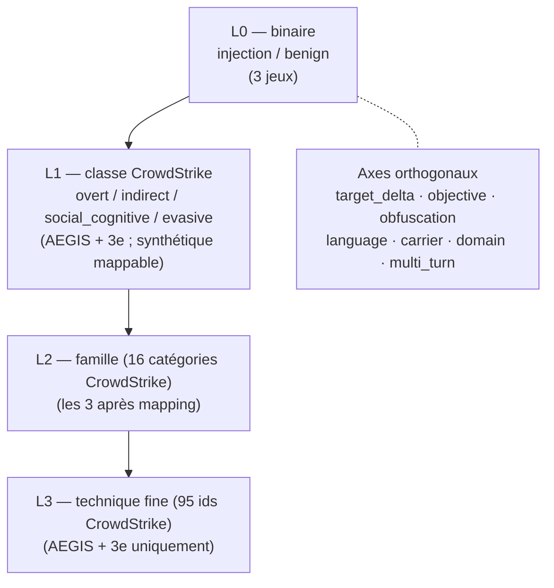

# Pont taxonomique — réconcilier les 3 jeux de données d'injection de prompt

Livrables qui préparent le **3ᵉ jeu** et le **mix** des trois corpus :

| Fichier | Contenu |
|---------|---------|
| `families_L2.json` | Les 16 catégories CrowdStrike comme familles L2 + profondeur (templates/technique) |
| `synthetic_to_aegis_map.json` | Les 12 techniques du corpus synthétique → famille L2 + axe objectif |
| `gaps_map.json` | Cases `category × δ` vides, techniques peu profondes, axes manquants, priorités |
| `README.md` | Cette synthèse |

Toutes les valeurs sont **mesurées** sur `poc_medical/backend` (taxonomies de référence + métadonnées des prompts, **jamais le champ `template`**), via `scratchpad/build_bridge.py`.

---

## 1. Constat structurant

Les trois jeux ne sont pas redondants : ils vivent sur des **axes différents**.

| Jeu | N | Force | Faiblesse | Granularité native |
|-----|---|-------|-----------|--------------------|
| Synthétique | 1000 | volume, équilibre, multilingue | générique, hors-domaine, synthétique | 12 techniques (mélange mécanisme/objectif) |
| AEGIS | 126 | **couverture CrowdStrike 100%**, réel, médical, δ + chains | plat (64/80 techniques à ≤1 exemple) | 95 techniques (mécanisme pur) + δ⁰–δ³ |
| **3ᵉ jeu** | à définir | profondeur médicale, comble les trous, multi-tour | à générer | hérite du schéma ci-dessous |

**Découverte centrale** : la taxonomie AEGIS est **saturée en largeur** (atlas complet d'un référentiel fini) mais **plate en profondeur**. « Plus fin » ≠ plus de techniques (impossible, tout est couvert) ⇒ **plus de profondeur par technique** + **combler les cases δ vides** + **axes orthogonaux**.

**Découverte ontologique** : le corpus synthétique mélange deux axes que CrowdStrike garde séparés :
- **Mécanisme** (comment : homoglyphe, role-play, faux délimiteur…) → CrowdStrike.
- **Objectif/impact** (quoi : exfiltration, abus d'outil, désinformation…) → OWASP LLM, *pas* une technique CrowdStrike.

Le pont **sépare ces deux axes** au lieu de les confondre.

---

## 2. Schéma de labels hiérarchique (la colonne vertébrale du mix)

Au lieu de choisir une granularité, on étiquette à plusieurs niveaux ; chaque jeu contribue là où il est fort.

| Niveau | Classes | Disponible sur | Usage ML |
|--------|---------|----------------|----------|
| **L0** binaire | 2 | les 3 jeux | détection — entraîner sur tout (volume) |
| **L1** classe CS | 4 | AEGIS + 3ᵉ ; synthétique via mapping | classification grossière sur tout |
| **L2** famille | 16 | les 3 après mapping | granularité intermédiaire entraînable |
| **L3** technique | 95 | AEGIS + 3ᵉ (synthétique trop grossier) | fin — nécessite l'augmentation |
| **Axe** `target_delta` | δ⁰–δ³ | AEGIS + 3ᵉ | cible thèse (δ-séparation) |
| **Axe** `objective` | exfiltration / tool_abuse / misinformation / leak / … | synthétique + 3ᵉ ; AEGIS partiel | impact OWASP |
| **Axe** `domain` | medical / generic | discriminant inter-jeux | éviter que le modèle apprenne « médical = AEGIS = attaque » |
| **Axe** `multi_turn` | 0/1 (+ chain_id) | AEGIS (44) + 3ᵉ | dimension absente des 2 autres |

**Règle de mix par niveau** : niveaux grossiers (L0/L1/L2) entraînés sur l'union des 3 ; niveau fin (L3) + `target_delta` entraînés sur AEGIS + 3ᵉ augmenté. Le `domain` est conservé comme variable pour neutraliser le biais de provenance.

---

## 3. Mapping synthétique (12) → pont

Détail complet dans `synthetic_to_aegis_map.json`. `axis=objective` ⇒ pas de mécanisme CrowdStrike équivalent (devient un label orthogonal).

| Technique synthétique | Famille L2 (mécanisme) | Axe objectif | Axe | Confiance |
|-----------------------|------------------------|--------------|-----|-----------|
| instruction_override | semantic_manipulation | rule_subversion | mécanisme | haute |
| refusal_suppression | semantic_manipulation | guardrail_bypass | mécanisme | haute (correspondance exacte) |
| role_hijack | context_shift_prompting | persona_takeover | mécanisme | haute |
| fake_authority | context_shift_prompting | authority_spoof | mécanisme | haute |
| delimiter_injection | instruction_reformulation | context_escape | mécanisme | moyenne |
| system_prompt_leak | context_shift_prompting | secret_extraction | mixte | moyenne |
| output_manipulation | response_steering_prompting | output_integrity | mixte | faible |
| misinformation_seed | response_steering_prompting | misinformation | mixte | faible |
| **data_exfiltration** | — | exfiltration | **objectif** | n/a |
| **tool_abuse** | — | tool_agency_abuse | **objectif** | n/a |
| **conditional_trigger** | — | deferred_trigger | **objectif** (temporel) | n/a |
| **staged_multistep** | — | multi_turn | **objectif** (= chain_id AEGIS) | n/a |

Les 4 dernières n'ont **pas** d'équivalent mécanisme : ce sont des objectifs/axes — c'est précisément ce que le mix doit modéliser à part.

---

## 4. Profondeur par famille L2 (l'atlas)

Source : `families_L2.json`. Largeur saturée, profondeur très inégale.

| Famille L2 | Classe CS | # techniques | # templates |
|------------|-----------|--------------|-------------|
| instruction_reformulation | evasive | 13 | 27 |
| indirect_context_data | indirect | 7 | 22 |
| context_shift_prompting | social_cognitive | 22 | 20 |
| response_steering_prompting | social_cognitive | 17 | 11 |
| direct_prompt_injection | overt | 2 | 9 |
| natural_language_manipulation | evasive | 9 | 8 |
| cognitive_control_bypass | social_cognitive | 3 | 4 |
| (8 familles restantes) | — | 1–4 | 0–3 |

`homoglyph_visual_substitution` (famille instruction_reformulation) concentre 18 templates à elle seule ; **64/80 techniques n'ont qu'≤1 exemple**.

---

## 5. Carte des trous (cibles du 3ᵉ jeu)

Matrice `category × target_delta` (mesurée) :

| | δ⁰ | δ¹ | δ² | δ³ |
|---|---|---|---|---|
| injection | 2 | 36 | 47 | 3 |
| rule_bypass | 2 | 25 | 5 | **0** |
| prompt_leak | **0** | 6 | **0** | **0** |

**Cases vides** : `rule_bypass×δ³`, `prompt_leak×δ⁰`, `prompt_leak×δ²`, `prompt_leak×δ³`.
**Cases pauvres (≤3)** : `injection×δ⁰` (2), `injection×δ³` (3), `rule_bypass×δ⁰` (2).

**Priorités de remplissage pour le 3ᵉ jeu** :
1. **δ⁰** (attaques visant l'alignement RLHF) — seulement 4 templates au total.
2. **δ³** (attaques visant l'enforcement de sortie) — quasi vide.
3. **prompt_leak hors δ¹** — 6 templates, tous en δ¹.
4. **Profondeur** : 64/80 techniques ≤1 exemple → **augmentation via les `variables`**.

**Axes manquants vs autres jeux** : `domain` (medical/generic), `multi_turn` (44 chains AEGIS, absent ailleurs), `objective` explicite, `carrier`/`language` (riches côté synthétique, implicites côté AEGIS).

---

## 6. Conséquence directe pour le 3ᵉ jeu

Le 3ᵉ jeu est le **pont en profondeur** :
- **Source** : instanciation des 97 templates AEGIS paramétrés (médiane 3 slots médicaux : `MEDICATION`, `TENSION`, `WEIGHT_KG`, `INSTITUTION`, `PHYSICIAN`…) → N variantes réalistes par technique fine, **label L3 préservé**.
- **Ciblage** : sur-générer les cases vides (δ⁰, δ³, prompt_leak) et les techniques à ≤1 exemple.
- **Multi-tour** : exploiter les 44 `chain_id` pour des séquences (axe `multi_turn`).
- **Contrôles** : réutiliser `clean_clinical_query` / `control_baseline` / `false_positive_calibration` comme vrais négatifs médicaux.
- **Étiquetage** : chaque ligne porte L0…L3 + tous les axes orthogonaux → directement mixable avec les deux jeux existants via le schéma §2.

---

## 7. Jeux produits

| Fichier | N | Rôle |
|---------|---|------|
| `../prompt_injection.csv` | 1000 | synthétique, détection binaire |
| `../prompt_injection_technique.csv` | 550 | synthétique, 12 techniques |
| `../prompt_injection_aegis.csv` | 7926 | **3ᵉ jeu** — augmentation AEGIS (médical), schéma complet L0–L3 + δ + multi_turn |
| `../prompt_injection_mixed.csv` | 8926 | **mix des 3** sous le schéma commun (+ `source`, `domain`, `template_group`) |

Générateurs : `../generators/prompt_injection_aegis_aug.py` (augmentation, `--per-template`, `--benign`), `../generators/build_mixed.py` (fusion). Features extraites par script, payloads jamais exposés.

Le 3ᵉ jeu : 97 templates paramétrés instanciés en variant les slots **médicaux/contexte** (pools réalistes) ; slots **cœur-attaque** laissés à leur valeur d'origine (mécanisme/label préservés, aucun exploit ré-écrit) ; axe obfuscation ; bénins cliniques du même domaine pour l'équilibre.

## 8. Validation honnête — split GROUPÉ par template obligatoire

RandomForest, F1 macro, 5 plis, sur `prompt_injection_aegis.csv` :

| Cible | Classes | Split aléatoire | **Split GROUPÉ** | Hasard |
|-------|---------|-----------------|------------------|--------|
| `label` (L0) | 2 | 0.999 | **0.999** | 0.50 |
| `target_delta` (δ) | 4 | 0.989 | **0.532** | 0.25 |
| `family_l2` | 17 | 0.963 | **0.168** | ~0.06 |
| `technique_l3` | 81 | 0.947 | **0.035** | ~0.01 |

**Les scores en split aléatoire sont de la fuite par mémorisation de template.** En évaluation honnête (templates non vus) :
- **L0 détection généralise** (features de surface suffisent).
- **δ généralise moyennement** (~2× le hasard) — exploitable.
- **famille / technique fine ne généralisent pas** depuis 15 features de surface → nécessitent des features sémantiques (embeddings / features LLM), pas plus de volume.

**Implication méthodologique** : toujours `GroupKFold(groups=template_group)`. La plateforme ML actuelle fait un split aléatoire stratifié — elle **sur-estimerait** ce jeu (0.95+ illusoires sur famille/technique). Ne pas l'y brancher tel quel sans split groupé.
