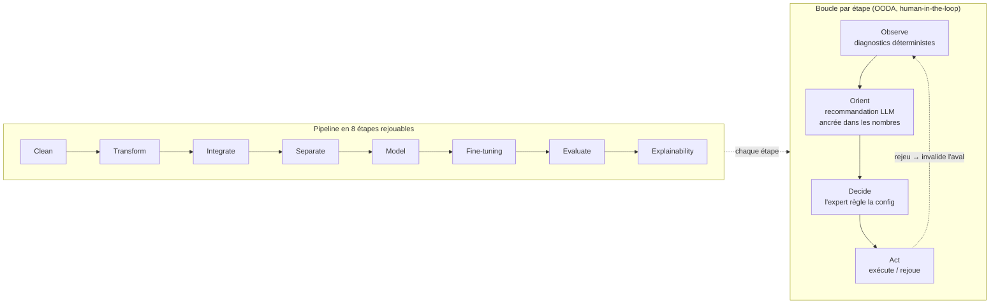
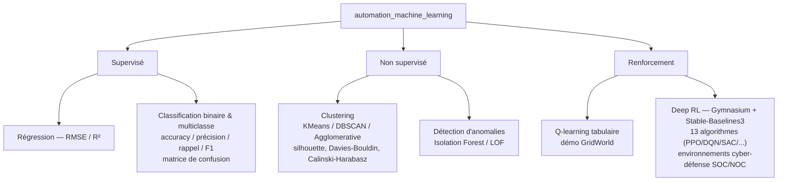
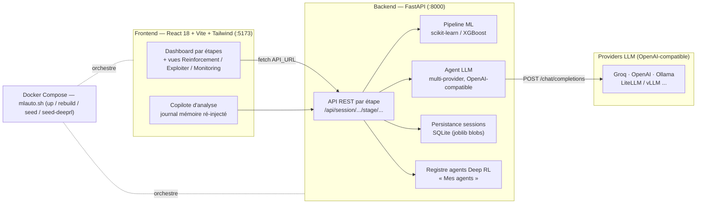

# automation_machine_learning — Descriptif exécutif

## En une phrase

Une plateforme qui construit un modèle de machine learning en **étapes explicites,
inspectables et rejouables**, où un **copilote LLM** *observe* les diagnostics chiffrés et
*oriente* par des recommandations ancrées dans les vrais nombres, pendant que **l'expert
décide et agit** — l'humain garde le contrôle (human-in-the-loop).

## Le problème adressé

Les outils d'AutoML masquent la construction du modèle derrière une boîte noire ; les
notebooks à la main sont rejouables mais sans garde-fou ni assistance. Cette application
marie les deux mondes :

- **la rigueur du ML classique** — modèles statistiques, métriques déterministes,
  reproductibilité ;
- **la fluidité des LLM** — raisonnement, recommandations contextuelles, explications en
  langage naturel.

## Boucle de travail — OODA par étape

Chaque étape du pipeline suit la même boucle **Observe → Orient → Decide → Act**.
Rejouer une étape **invalide automatiquement les étapes en aval** (cohérence garantie).

## Les 3 paradigmes d'apprentissage couverts

## Architecture technique

- **Frontend** : React 18 + Vite + Tailwind, port **5173**. Le navigateur dérive l'URL
  backend depuis l'origine de la page (accès LAN sans rebuild).
- **Backend** : FastAPI + uvicorn, port **8000**. Pipeline scikit-learn / XGBoost, agent LLM
  multi-provider, persistance des sessions en SQLite (blobs `joblib`).
- **Runtime** : Docker Compose, cycle de vie via `mlauto.sh` (`up`, `rebuild`, `seed`,
  `seed-deeprl`, `test`, `clean`).

## Couche agentique (mode assisté)

- **Copilote d'analyse** (panneau latéral) : assistants contextuels + **journal mémoire** —
  chaque réponse IA est enregistrée et **ré-injectée dans les prompts suivants**.
- **Une IA par graphique** : chaque figure a sa légende et un bouton d'explication ; la
  réponse s'affiche en ligne sous le graphique.
- **Tables de décision** : l'expert coche les colonnes/features à garder (conseil IA + raison).
- **Gouvernance des prompts** : tout prompt LLM est éditable et repérable via le panneau
  « Prompts IA » (zéro prompt codé en dur).
- **Multi-provider** : tout provider OpenAI-compatible (Groq, OpenAI, Ollama, LiteLLM,
  vLLM…), clé et modèle configurables à l'exécution.

## Le modèle en action (au-delà de l'entraînement)

Une fois le modèle produit, la vue **Exploiter** le rend interrogeable pour **n'importe quel
modèle du pipeline** : prédiction unitaire, prédiction par lot (CSV), analyses de sensibilité
et diagramme tornado, point de fonctionnement (seuil), export d'un bundle auto-descriptif
(modèle + rapport de métriques). S'y ajoutent le suivi (**Monitoring**) et la fiche modèle.

## Modèles exemples prêts à l'emploi

- **Pipeline classique** : `mlauto.sh seed` rejoue le pipeline sur les 13 datasets démo →
  un modèle exemple entraîné par jeu de données, présent dès l'installation (idempotent).
- **Deep RL SOC/NOC** : `mlauto.sh seed-deeprl` entraîne et sauvegarde des agents exemples
  dans le registre « Mes agents » (idempotent, ~20 min ; commande séparée, non lancée par
  `up`/`rebuild`).

## Public visé

Expert data/ML qui veut la **traçabilité** d'un pipeline fait main **plus** l'assistance d'un
copilote — sans céder la décision à une boîte noire.
